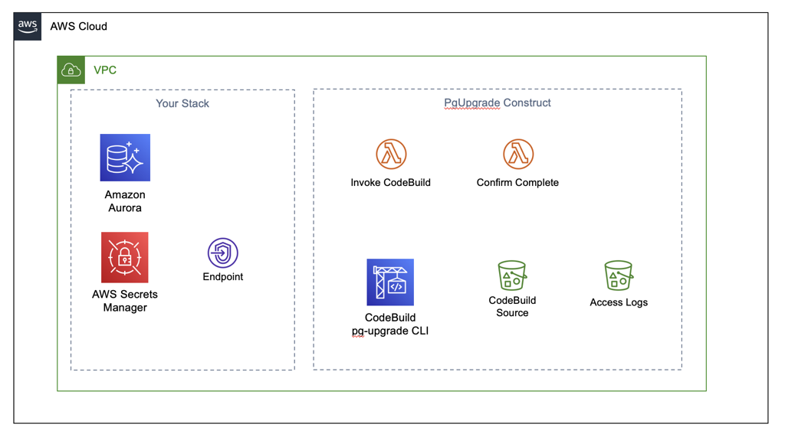

# PgUpgrade

## Postgresql Schema Upgrade

NOTE: This is an experimental work in progress and not supported in any way!

This construct applies schema upgrades to a Postgresql database. It runs an NPM
package called [pg-upgrade](https://www.npmjs.com/package/pg-upgrade) within a
CodeBuild job every time a stack that contains this construct is deployed. See
the README for that package to learn about how your schema upgrade scripts need
to be organized, and how you can use the CLI to apply changes to a local
database.

## Usage

Create a local folder in your project to contain your schema creation files.
In this example it's called `schema`. Also create a folder to contain build artifacts
that get created when you run `cdk synth`. This construct uses Webpack to bundle the 
Lambda functions necessary to invoke the CodeBuild job and check on progress. In this 
example, the folder is at the top level, called `build`. Call it something else if your 
project already has a build folder used for other purposes.

```JavaScript

const pgUpgrade = new PgUpgrade(this, 'upgrade', {
    schemaFolder: path.join(__dirname, "schema"),
    buildFolder: path.join(__dirname, "build") ,
    verbose: true,
    vpc, 
    cluster,
    secretsEndpoint,
    securityGroups,
    region: "us-east-1",
    schemaName: "public"
})

```

## CDK Nag

If you are using `cdk-nag` to validate the security compliance of your CDK
application, you will get a number of warnings from this library, due to
resources controlled by the `aws-cdk-lib` package. These are difficult or
impossible to mitigate, and are in any case false positives. All warnings that
were valid and fixable have been fixed. If you want to save some time in
developing suppressions, take a look at `/test/nag.ts`.


## Architecture


